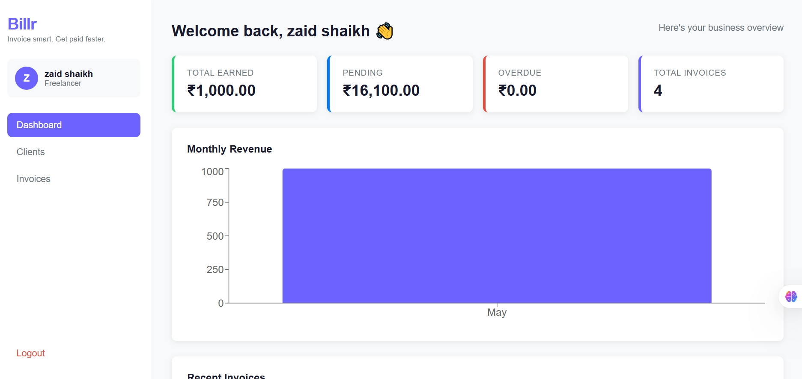
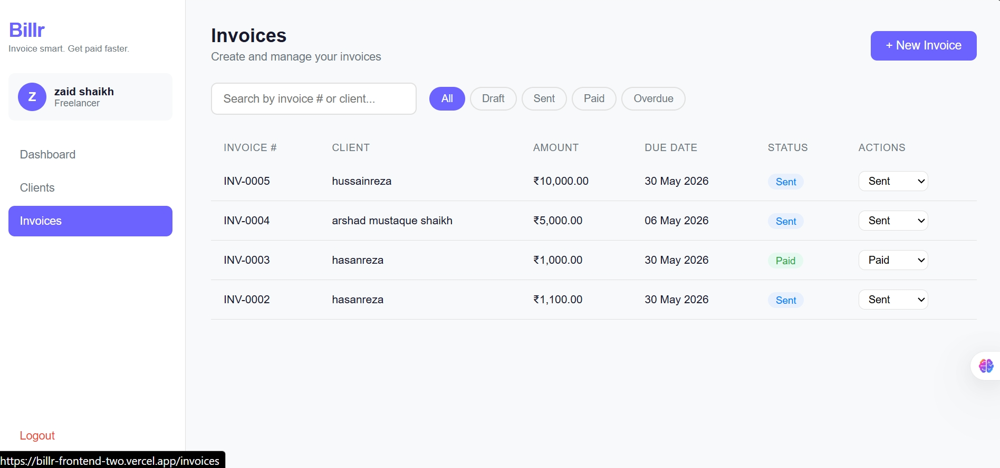
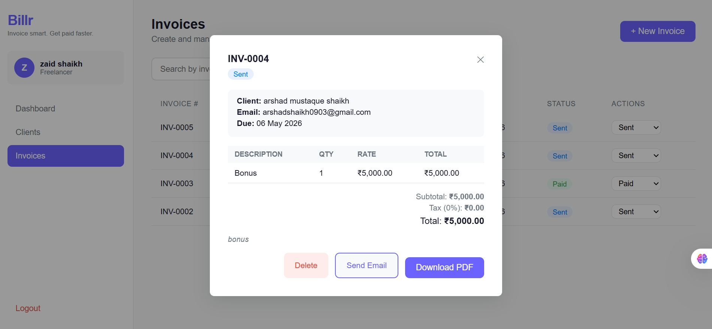
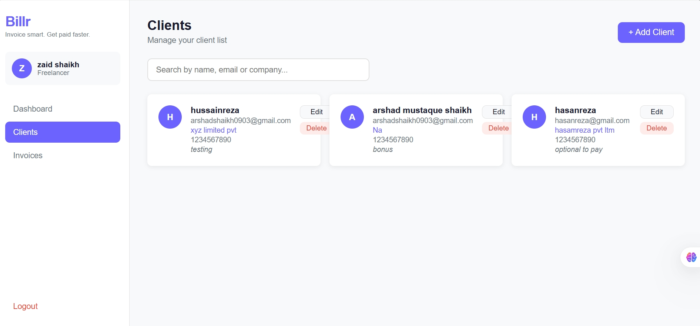

# Billr 💸 — Freelancer Invoice Manager

> **Invoice smart. Get paid faster.**

A full-stack invoicing and client management web app built for freelancers. Create professional invoices, track payment status, export PDFs, and send invoices directly to clients via email — all from one clean dashboard.

🌐 **Live Demo:** [billr-frontend-two.vercel.app](https://billr-frontend-two.vercel.app/)
⚙️ **Backend API:** [billr-backend-i0jt.onrender.com](https://billr-backend-i0jt.onrender.com)

---

## Screenshots

| Dashboard | Invoices |
|-----------|----------|
|  |  |

| Invoice Detail | Clients |
|----------------|---------|
|  |  |

---

## Features

- **JWT Authentication** — Secure register/login with token-based session management
- **Client Management** — Add, edit, delete clients with search functionality
- **Invoice CRUD** — Create invoices with multiple line items, tax calculation, and auto-generated invoice numbers
- **Status Tracking** — Track invoices as Draft, Sent, Paid, or Overdue
- **PDF Export** — Download professional branded invoices as PDF
- **Email Integration** — Send invoices directly to client email via Brevo API
- **Revenue Dashboard** — Monthly revenue bar chart, total earned, pending, and overdue stats
- **Protected Routes** — Auth-guarded pages, redirects unauthenticated users to login
- **Clean Architecture** — SOLID principles, layered structure, separated service and UI layers

---

## Tech Stack

**Frontend**
- React.js, React Router, Context API
- Axios, Recharts, react-hot-toast
- Layered CSS with CSS variables

**Backend**
- Node.js, Express.js
- MongoDB, Mongoose
- JWT, bcryptjs
- PDFKit (PDF generation)
- Brevo API (transactional email)

**Deployment**
- Frontend → Vercel
- Backend → Render
- Database → MongoDB Atlas

---

## Getting Started

### Prerequisites
- Node.js v18+
- MongoDB Atlas account
- Brevo account (for email)

### Clone the repo

```bash
git clone https://github.com/zaid-shaikh17/Billr-Backend.git
git clone https://github.com/zaid-shaikh17/Billr-Frontend.git
```

### Backend setup

```bash
cd Billr-Backend
npm install
```

Create `.env`:

```env
MONGODB_URI=your_mongodb_connection_string
JWT_SECRET=your_jwt_secret
PORT=4000
EMAIL_USER=your_gmail@gmail.com
BREVO_API_KEY=your_brevo_api_key
```

```bash
npm run server
```

### Frontend setup

```bash
cd Billr-Frontend
npm install
```

Create `.env`:

```env
VITE_API_URL=http://localhost:4000
```

```bash
npm run dev
```

---

## Folder Structure

```
Billr-Frontend/
├── src/
│   ├── components/     # Sidebar, Layout  
│   ├── context/        # AuthContext, DataContext
│   ├── pages/          # Dashboard, Clients, ClientDetail, Invoices, Login, Register
│   ├── services/       # api.js — all axios calls
│   ├── styles/         # Shared CSS
│   └── utils/          # helpers.js — formatCurrency, formatDate
└── package.json

Billr-Backend/
├── config/             # DB connection
├── controllers/        # auth, clients, invoices, pdf, email
├── middleware/         # JWT auth
├── models/             # User, Client, Invoice
├── routes/
├── utils/              # helpers.js
└── server.js
```

---

## Environment Variables

| Variable | Description |
|----------|-------------|
| `MONGODB_URI` | MongoDB Atlas connection string |
| `JWT_SECRET` | Secret key for JWT signing |
| `EMAIL_USER` | Gmail address used as sender |
| `BREVO_API_KEY` | Brevo transactional email API key |

---

## Related Repos

| Repo | Description |
|------|-------------|
| [Billr Frontend](https://github.com/zaid-shaikh17/Billr-Frontend) | React.js client app |
| [Billr Backend](https://github.com/zaid-shaikh17/Billr-Backend) | Express + MongoDB REST API |

---

## Author

**Shaikh Zaid** — [GitHub](https://github.com/zaid-shaikh17) · [LinkedIn](https://www.linkedin.com/in/shaikh-zaid-m8329981925/)

---

*Built as a real-world project to solve freelancer invoicing pain. Open to fresher MERN-stack or Front-end roles and internships.*
